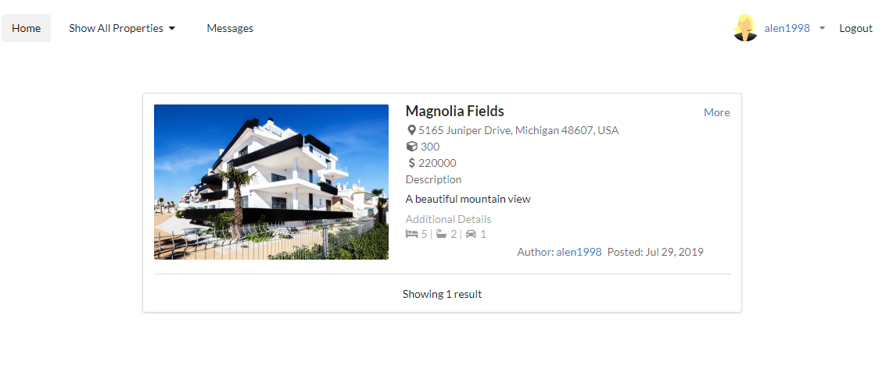

# 

> ### Example Node (Express + Mongoose) real world application example (CRUD, auth, REST, etc.).

# Getting started

To get the Node server running locally:

- Clone this repo
- `npm install` to install all required dependencies
- Install MongoDB Community Edition ([instructions](https://docs.mongodb.com/manual/installation/#tutorials)) and run it by executing `mongod`
- `npm run dev` to start the local server

Alternately, to quickly try out this repo in Heroku: https://real-estate-app-77.herokuapp.com/

# Code Overview

## Dependencies

- [body-parser](https://github.com/expressjs/body-parser) - Node.js body parsing middleware.
- [connect-flash](https://github.com/jaredhanson/connect-flash) - Flash message middleware for Connect and Express.
- [ejs](https://github.com/mde/ejs) - Embedded JavaScript templates.
- [express.js](https://github.com/expressjs/express) - The server for handling and routing HTTP requests.
- [method-override](https://github.com/expressjs/method-override) - Override HTTP verbs.
- [moment.js](https://github.com/moment/moment) - Parse, validate, manipulate, and display dates in javascript.
- [mongoose](https://github.com/Automattic/mongoose) - For modeling and mapping MongoDB data to JavaScript. 
- [passport.js](https://github.com/jaredhanson/passport) - For handling user authentication.
- [passport-local](https://github.com/jaredhanson/passport-local) - Passport.js strategy for authenticating with a username and password.
- [passport-local-mongoose](https://github.com/saintedlama/passport-local-mongoose) - Passport-Local Mongoose is a Mongoose plugin that simplifies building username and password login with Passport.js.

## Application Structure

- `app.js` - The entry point to my application. This file defines our express server and connects it to MongoDB using mongoose. It also requires the routes and models I'll be using in the application.
- `routes/` - This folder contains the route definitions.
- `models/` - This folder contains the schema definitions for my Mongoose models.
- `middleware/` - This folder contain middleware.
- `views/` - This folder contains view engine .ejs files.
- `public/` - This folder serve static files in Express.js

## Error Handling

Using Flash massages.
